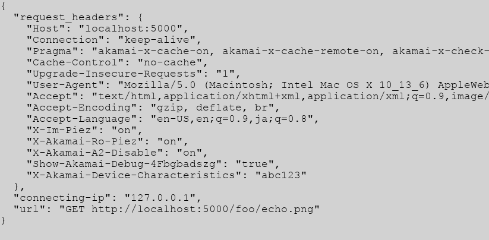

# Dresp
A web server serving stupid responses

Github: [https://github.com/ktmrmshk/Dresp](https://github.com/ktmrmshk/Dresp)

Dresp supports methods HEAD, GET, POST, DELETE and DELETE.

```
Your Browser                           Stupid Responder
(client)                               (Dresp) as an Origin Server

+--------------+ * Query Strings      +------------------------------------+
|              | * Requesst Headers   |                                    |
|    requrst1  | +----------------------------------+                      |
|              |                      |             v                      |
|              |    w/ Intentional    |   * Generating response headers    |
|              |    Response Header   |             +                      |
|    response1 | <----------------------------------+                      |
+--------------+                      |                                    |
                                      |                                    |
+--------------+                      |                                    |
|              |  * /foobar/4xx.html  |                                    |
|    request2  | +----------------------------------+                      |
|              |                      |             v                      |
|              |                      |   * Generating 4xx/5xx response    |
|              |  Intentional 4xx page|             +                      |
|    response2 | <----------------------------------+                      |
+--------------+                      |                                    |
                                      +------------------------------------+

```

# Installation

## from Dockerhub (easiest way)

Open termial on a machine docker's installed, and

```
# docker run -d -p 8080:5000 ktmrmshk/dresp 
```

Then, open your browser and access to this server like `http://to.this.server.com:8080/`.


## from Dockerfile

From this git repository,

```
# git clone https://github.com/ktmrmshk/Dresp.git
# cd Dresp
# docker build -t dresp .
# docker run -d -p 8080:5000 dresp  
```


# Usage

## Accessing Objects

Stupid Responder (Rresp) serves following content:

* file_prefix: example
* file_type: html, txt, pdf, js, png, css, jpg, mp4, webp, webm, ttf, woff, woff2,svg

For instance, you can get jpeg file by "http://to.this.server.com/YourPath/example.jpg".

The middle of full-path "YourPath" can be set any string you want, because this path string
is ignored in the servering process.

Here are examples of the path to each content:

* http://to.dresp.server.com/YourPath/example.jpg
* http://to.dresp.server.com/FooBar/example.html
* http://to.dresp.server.com/ABC123/example.txt
* http://to.dresp.server.com/HiLows/example.pdf
* http://to.dresp.server.com/AbcXyz/example.js
* http://to.dresp.server.com/XXXXXX/example.png
* http://to.dresp.server.com/123456/example.css
* http://to.dresp.server.com/hogepo/example.mp4
* http://to.dresp.server.com/FooBar/example.json
* http://to.dresp.server.com/FooBar/example.webp
* http://to.dresp.server.com/FooBar/example.webm
* http://to.dresp.server.com/FooBar/example.svg
* http://to.dresp.server.com/FooBar/example.woff
* http://to.dresp.server.com/FooBar/example.woff2
* http://to.dresp.server.com/FooBar/example.ttf

* http://to.dresp.server.com/FooBar/example.json?Cache-Control=no-store&Set-Status-Code=201
* http://to.dresp.server.com/FooBar/echo.html
* http://to.dresp.server.com/FooBar/echo.jpg
* http://to.dresp.server.com/FooBar/200x600.jpg

* http://to.dresp.server.com/site/shop/

## Set-up Favorite Response Headers w/ Query Strings

You can set-up favorite respinse headers using query string on a request.
Formt is like `?Your-Header=your-value&Cache-Control=no-store`, then you get
objects with response header including:

* `Your-Header: your-value`
* `Cache-Control: no-store`

If you want to delete specific response header, pass the query without any value.
e.g. to delete `Cache-Control` header, pass the request with query like `?Cache-Control=`.

### Examples

* http://to.dresp.server.com/YourPath/example.jpg?Cache-Control=no-cache&Vary=User-Agent
* http://to.dresp.server.com/YourPath/example.jpg?Edge-Control=no-store


## Set-up Favorite Response Headers w/ Requrst Header

Also, setting up response header can be done by `Set-Response-Header` request header with json formatted data, like:

* `Set-Response-Header: {"abc":123, "Edge-Control":"no-store"}`


### Example:

```
$ curl -I -H 'Set-Response-Header: {"abc":123, "Edge-Control":"no-store"}' http://to.dresp.server.com/YourPath/example.jpg

HTTP/1.0 200 OK
Content-Length: 433315
Content-Type: image/jpeg
Last-Modified: Tue, 13 Jun 2017 06:40:35 GMT
Cache-Control: public, max-age=43200
Expires: Wed, 14 Jun 2017 00:23:54 GMT
ETag: "1497336035.0-433315-913314996"
Date: Tue, 13 Jun 2017 12:23:54 GMT
Accept-Ranges: bytes
abc: 123
Edge-Control: no-store
```

## Set-Cookie Response

There're 3 ways:
1. simple mode by query string - single set-cookie
2. simple mode by request header - single set-cookie
3. advanced mode by request header - multiple set-cookies with full cookie attribution, i.e max-age, same-site policy and so on. 

### simple mode by query string - single set-cookie

To get `Set-Cookie: sessionId=abc123`, type

```
$ curl -I -XGET 'http://to.dresp.server.com/YourPath/example.html?Set-Cookie=sessionId=abc123'

HTTP/1.0 200 OK
Content-Length: 9603
Content-Type: text/html; charset=utf-8
Last-Modified: Sat, 18 Jul 2020 12:28:07 GMT
Cache-Control: public, max-age=43200
Expires: Thu, 08 Oct 2020 22:39:36 GMT
ETag: "1595075287.2517724-9603-1268782376"
Date: Thu, 08 Oct 2020 10:39:36 GMT
Accept-Ranges: bytes
set-cookie: sessionId=abc123
Request-Headers: {"Host": "to.dresp.server.com", "User-Agent": "curl/7.64.1", "Accept": "*/*"}
Response-Headers: {"Content-Length": "9603", "Content-Type": "text/html; charset=utf-8", "Last-Modified": "Sat, 18 Jul 2020 12:28:07 GMT", "Cache-Control": "public, max-age=43200", "Expires": "Thu, 08 Oct 2020 22:39:36 GMT", "ETag": "\"1595075287.2517724-9603-1268782376\"", "Date": "Thu, 08 Oct 2020 10:39:36 GMT", "Accept-Ranges": "bytes", "set-cookie": "sessionId=abc123"}
Request-Cookies: {}
Connection-IP: 127.0.0.1
Server: Werkzeug/0.16.0 Python/3.8.0
```

### simple mode by request header

To get `Set-Cookie: sessionId=abc123`, type

```
$ curl -I -XGET -H 'Set-Response-Header: { "Set-Cookie": "sessionId=abc123" }' http://to.dresp.server.com/foobar/index.html

HTTP/1.0 200 OK
Content-Length: 597321
Content-Type: text/html; charset=utf-8
Last-Modified: Thu, 08 Oct 2020 08:09:28 GMT
Cache-Control: public, max-age=43200
Expires: Thu, 08 Oct 2020 22:42:38 GMT
ETag: "1602144568.37552-597321-558109780"
Date: Thu, 08 Oct 2020 10:42:38 GMT
Accept-Ranges: bytes
Set-Cookie: sessionId=abc123; Path=/
Request-Headers: {"Host": "to.dresp.server.com", "User-Agent": "curl/7.64.1", "Accept": "*/*", "Set-Response-Header": "{ \"Set-Cookie\": \"sessionId=abc123\" }"}
Response-Headers: {"Content-Length": "597321", "Content-Type": "text/html; charset=utf-8", "Last-Modified": "Thu, 08 Oct 2020 08:09:28 GMT", "Cache-Control": "public, max-age=43200", "Expires": "Thu, 08 Oct 2020 22:42:38 GMT", "ETag": "\"1602144568.37552-597321-558109780\"", "Date": "Thu, 08 Oct 2020 10:42:38 GMT", "Accept-Ranges": "bytes", "Set-Cookie": "sessionId=abc123; Path=/"}
Request-Cookies: {}
Connection-IP: 127.0.0.1
Server: Werkzeug/0.16.0 Python/3.8.0
```

### advanced mode by request header

Multiple Set-Cookies with full cookie attribution are supported.

To get two set-cookies, which are `Set-Cookie: sessionId=abc123` and `userId=xyz987`, send request with header of:

```
Set-Response-Header: {
    "Set-Cookie": [
        { "key": "sessionId", "value": "abc123"},
        { "key": "userId", "value": "xyz987"}
    ]
}
```

Full request command is

```
$ curl -I -XGET -H 'Set-Response-Header: { "Set-Cookie": [{"key":"sessionId", "value":"abc123"}, {"key": "userId", "value": "xyz987"}] }' http://to.dresp.server.com/foobar/index.html

HTTP/1.0 200 OK
Content-Length: 597321
Content-Type: text/html; charset=utf-8
Last-Modified: Thu, 08 Oct 2020 08:09:28 GMT
Cache-Control: public, max-age=43200
Expires: Thu, 08 Oct 2020 23:37:12 GMT
ETag: "1602144568.37552-597321-558109780"
Date: Thu, 08 Oct 2020 11:37:12 GMT
Accept-Ranges: bytes
Set-Cookie: sessionId=abc123; Path=/
Set-Cookie: userId=xyz987; Path=/
Request-Headers: {"Host": "to.dresp.server.com", "User-Agent": "curl/7.64.1", "Accept": "*/*", "Set-Response-Header": "{ \"Set-Cookie\": [{\"key\":\"sessionId\", \"value\":\"abc123\"}, {\"key\": \"userId\", \"value\": \"xyz987\"}]}"}
Response-Headers: {"Content-Length": "597321", "Content-Type": "text/html; charset=utf-8", "Last-Modified": "Thu, 08 Oct 2020 08:09:28 GMT", "Cache-Control": "public, max-age=43200", "Expires": "Thu, 08 Oct 2020 23:37:12 GMT", "ETag": "\"1602144568.37552-597321-558109780\"", "Date": "Thu, 08 Oct 2020 11:37:12 GMT", "Accept-Ranges": "bytes", "Set-Cookie": "userId=xyz987; Path=/"}
Request-Cookies: {}
Connection-IP: 127.0.0.1
Server: Werkzeug/0.16.0 Python/3.8.0
```

In the advanced mode, [full set-cookie attributes](https://flask.palletsprojects.com/en/1.1.x/api/#flask.Response.set_cookie) are available such as:

* key
* value
* max_age
* expires
* path 
* domain
* secure
* httponly
* samesite

For exmaple, 

```
{
    "Set-Cookie": [
        {
            "key": "sessionId",
            "value": "abc123",
            "expires": "Wed, 09 Jun 2021 10:18:14 GMT",
            "domain": "www.foobar123.com",
            "secure": true,
            "samesite": "Lax"
        },
        {
            "key": "userId",
            "value": "xyz987",
            "path": "/sub"
        }
    ]
}
```

Actual request command would be

```
$ curl -I -XGET -H 'Set-Response-Header: {"Set-Cookie":[{"key":"sessionId","value":"abc123","expires":"Wed, 09 Jun 2021 10:18:14 GMT","domain":"www.foobar123.com","secure":true,"samesite":"Lax"},{"key":"userId","value":"xyz987","path":"/sub"}]}' http://to.dresp.server.com/foobar/index.html

HTTP/1.0 200 OK
Content-Length: 597321
Content-Type: text/html; charset=utf-8
Last-Modified: Thu, 08 Oct 2020 08:09:28 GMT
Cache-Control: public, max-age=43200
Expires: Thu, 08 Oct 2020 23:54:47 GMT
ETag: "1602144568.37552-597321-558109780"
Date: Thu, 08 Oct 2020 11:54:47 GMT
Accept-Ranges: bytes
Set-Cookie: sessionId=abc123; Domain=www.foobar123.com; Expires=Wed, 09 Jun 2021 10:18:14 GMT; Secure; Path=/; SameSite=Lax
Set-Cookie: userId=xyz987; Path=/sub
Request-Headers: {"Host": "to.dresp.server.com", "User-Agent": "curl/7.64.1", "Accept": "*/*", "Set-Response-Header": "{\"Set-Cookie\":[{\"key\":\"sessionId\",\"value\":\"abc123\",\"expires\":\"Wed, 09 Jun 2021 10:18:14 GMT\",\"domain\":\"www.foobar123.com\",\"secure\":true,\"samesite\":\"Lax\"},{\"key\":\"userId\",\"value\":\"xyz987\",\"path\":\"/sub\"}]}"}
Response-Headers: {"Content-Length": "597321", "Content-Type": "text/html; charset=utf-8", "Last-Modified": "Thu, 08 Oct 2020 08:09:28 GMT", "Cache-Control": "public, max-age=43200", "Expires": "Thu, 08 Oct 2020 23:54:47 GMT", "ETag": "\"1602144568.37552-597321-558109780\"", "Date": "Thu, 08 Oct 2020 11:54:47 GMT", "Accept-Ranges": "bytes", "Set-Cookie": "userId=xyz987; Path=/sub"}
Request-Cookies: {}
Connection-IP: 127.0.0.1
Server: Werkzeug/0.16.0 Python/3.8.0
```


## Checking request / response headers at this server catch

Dresp returns debuging info as a json data in response header as follows:

* `Request-Headers`
* `Request-Cookies`
* `Response-Headers`
* `Connection-IP`

### Example:

```
$ curl -I http://dresp.server.com/hogepo/example.html

HTTP/1.0 200 OK
Content-Length: 9603
Content-Type: text/html; charset=utf-8
Last-Modified: Tue, 13 Jun 2017 06:40:34 GMT
Cache-Control: public, max-age=43200
Expires: Wed, 14 Jun 2017 00:18:12 GMT
ETag: "1497336034.0-9603-1268782376"
Date: Tue, 13 Jun 2017 12:18:12 GMT
Accept-Ranges: bytes
Request-Headers: {"Accept": "*/*", "Host": "to.dresp.server.com", "User-Agent": "curl/7.50.0"}
Response-Headers: {"Last-Modified": "Tue, 13 Jun 2017 06:40:34 GMT", "Content-Type": "text/html; charset=utf-8", "Cache-Control": "public, max-age=43200", "ETag": "\"1497336034.0-9603-1268782376\"", "Content-Length": "9603", "Date": "Tue, 13 Jun 2017 12:18:12 GMT", "Accept-Ranges": "bytes", "Expires": "Wed, 14 Jun 2017 00:18:12 GMT"}
Request-Cookies: {}
Server: Werkzeug/0.12.1 Python/3.5.2
```

## Getting Intentional 4xx/5xx response by Path 

You get intentional 4xx/5xx response by accessing 

* http://to.dresp.server.com/hogepo/403.html
* http://to.dresp.server.com/hogepo/503.html

Dresp returns the any 4xx/5xx response status you need.


## Getting Interntional 4xx/5xx response w/ Query String

If you need interntional 4xx/5xx response at the same Path as usual content like "http://dresp.server.com/hogepo/example.html", use `Set-Status-Code` query parameter along with the request path as follows:

* http://dresp.server.com/hogepo/example.html?Set-Status-Code=404"
* http://dresp.server.com/hogepo/example.html?Set-Status-Code=503"


## Getting Interntional 4xx/5xx response w/ Request Header

Similarly, you can get intentional 4xx/5xx on specific path with Request Header `Set-Status-Code`.

### Example: using curl command, 

```
$ curl -H "Set-Status-Code: 404" http://dresp.server.com/hogepo/example.html

HTTP/1.0 404 NOT FOUND
```


## Making Redirect w/ Query Strings

For getting redirect response, two parameters are needed as you know, which are status code of 30x and`Location` header to be redirected to. The status code can be given `Set-Status-Code` paramer, while `Location` can be given as the same way like other headers. 

To get redirect response to "http://www.abc.com" with status code 302 when you access to "http://dresp.server.com/hogepo/example.html",

* http://dresp.server.com/hogepo/example.html?Set-Status-Code=302&Location=http://www.abc.com


## Making Redirect w/ Request Headers

Likewise, redirect response can be set up by request headers --- `Set-Status-Code` header and `Location` entry in `Set-Reponse-Header` header.

```
$ curl -H "Set-Status-Code: 302" -H 'Set-Response-Header: {"Location": "http://www.abc.com"}' http://dresp.server.com/hogepo/example.html

HTTP/1.0 302 TEMPORARY REDIRECT
Location: http://www.abc.com
```

## Redirect Chain

To test direct chain, dresp redirects `/foobar/redirect/{30X}/{n}` to `/foobar/redirect/{30X}/{n-1}`.
For example,

```
$ curl -I http://dresp.server.com/foo123/redirect/302/10

302 HTTP/1.0
Location: http://dresp.server.com/foo123/redirect/302/9
```

If request comes with query string, it will be redirected with query string.
And, dresp redirects all these request of `{n} < 1` to top path '/'.


## Response Delay

Dresp serves content with response delay time. This delay time can be specified by `Set-Response-Delay` query or request header. To add 2.5 seconds delay in response, 

```
## by query string
$ curl 'http://dresp.server.com/foo123/example.html?Set-Response-Delay=2.5'

## by request header
$ curl 'http://dresp.server.com/foo123/example.html' -H 'Set-Response-Delay: 2.5'
```


## Demo Web Site

Dresp provides the demo web site with specific path '/site/shop/':

* http://to.dresp.server.com/site/shop/


## Arbitrary size images

You can get any size of JPG/PNG/GIF. To get 640x480 px images, 

* http://to.dresp.server.com/foobar/640x480.jpg
* http://to.dresp.server.com/abc123/640x480.png
* http://to.dresp.server.com/anystr/640x480.gif


## Echo mode

Echo mode path returns content that includes request url, header, client ip, and date.
This mode supports .txt, .html, .js, .xml, .css, .jpg, .png, and .gif.


* http://to.dresp.server.com/foobar/echo.txt
* http://to.dresp.server.com/foobar/echo.html
* http://to.dresp.server.com/foobar/echo.json
* http://to.dresp.server.com/foobar/echo.css
* http://to.dresp.server.com/foobar/echo.xml
* http://to.dresp.server.com/foobar/echo.jpg
* http://to.dresp.server.com/foobar/echo.png
* http://to.dresp.server.com/foobar/echo.gif




# Directory

Representive paths:

* http://to.dresp.server.com/ : Top page (including help)
* http://to.dresp.server.com/index.html : Top page (including help)

* http://to.dresp.server.com/hogepo/example.jpg : jpeg object page
* http://to.dresp.server.com/hogepo/example.html : html object page

* http://to.dresp.server.com/hogepo/403.html : Intentional 403 error page


